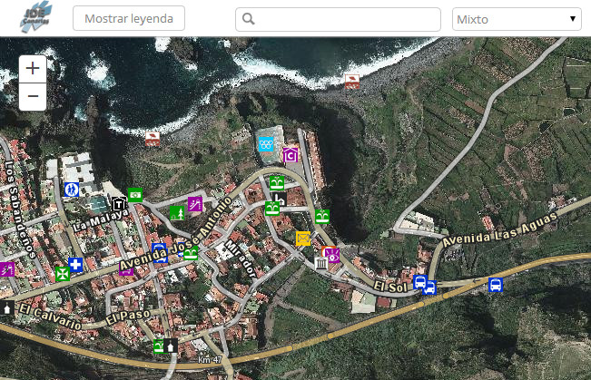

## Incluir un mapa ##

Este tutorial muestra cómo integrar los servicios de mapas WMS de IDECanarias dentro de la [API Javascript de ArcGIS Online](http://js.arcgis.com).

Puedes ver un ejemplo de cómo añadir uno en tu propia página haciendo clic en el siguiente mapa:  



## Personalizar un mapa ##

Vamos a ver cómo funciona este mapa, para ello vamos explicar el código HTML y Javascript. El CSS no contiene ningún código que merezca la pena destacar especialmente.

### HTML ###

Dentro de la etiqueta *head* sólo cabe destacar el siguiente código  
```
	<script>var dojoConfig = { parseOnLoad:true };</script>	
	<script src="http://js.arcgis.com/3.9compact/"></script>
	<script src="grafcan.js"></script>
```

La primera línea asegura que las funciones Javascript se ejecuten cuando se dispare el evento *ready* de Dojo (que es el framework sobre el que está construida la API de Javascript de ArcGIS Online). 
__Nota__: se puede utilizar el modo de compatibilidad de Dojo que permite crear aplicaciones que combinen otros frameworks: jQuery, ExtJS, etc. ya que son compatibles.

La segunda simplemente solicíta la versión compacta de la versión 3.9 de la API de Javascript. Y la tercera incluye las llamadas necesarias para crear el mapa y asociarle su comportamiento.

En en cuerpo (*body*) del fichero HTML se ha añadido un selector de mapas:

```
	<div id="mapLayers">
        <select id="selectLayers">
          <option value="http://idecan2.grafcan.es/ServicioWMS/Callejero" class="layer">Callejero</option>
          <option value="http://idecan1.grafcan.es/ServicioWMS/OrtoUrb" class="layer">Ortofoto</option>
          <option value="http://idecan2.grafcan.es/ServicioWMS/Callejero?map=/home/datos/mapas/Callejero/CallejeroTxt.map" class="layer">Mixto</option>
          <option value="http://idecan2.grafcan.es/ServicioWMS/MTI" class="layer">Topográfico</option>
        </select>
      </div>
```

En este caso se le ha indicado en el valor de cada opción la URL del servicio que carga cada mapa simplemente para simplificar el código en las llamadas del fichero *grafcan.js*.

### Javascript ###

Las primeras líneas cargan las dependencias de la aplicación.

```
var map;
require([
  "esri/map",
  "esri/arcgis/utils",
  "dojo/domReady!",
  "esri/dijit/Geocoder",
  "esri/dijit/Legend"
  ], function(Map, arcgisUtils){
``` 

*esri/map* en la base que permite crear mapas interactivos. *esri/arcgis/utils* incluye las funciones para cargar los servicios WMS. *dojo/domReady!* es el plugin que espera hasta que el DOM esté cargado para avisar al resto de funciones. Las otras dos dependencias son las que incluyen los widgets que nos facilitarán la creación del geocodificador y de la leyenda.

A continuación se crea un mapa a partir de un webmap de ArcGIS Online:
	```
	arcgisUtils.createMap("8eb5d173bca74ffaa2ca5bc928775fc4", "mapDiv")
	```

Donde *8eb5d173bca74ffaa2ca5bc928775fc4* es el identificador del [webmap](http://hhkaos.maps.arcgis.com/home/webmap/viewer.html?webmap=8eb5d173bca74ffaa2ca5bc928775fc4) desde el que se han cargado previamente los servicios WMS de Grafcan.

A continuación creamos el geocodificador usando el widget:

```
	geocoder = new esri.dijit.Geocoder({
        map: map,
        autoComplete: true,
        arcgisGeocoder: {
          name: "Esri World Geocoder",
          suffix: " Redlands, CA"
        }
      },"search");
      geocoder.startup();
```

Como vemos, recibe como parámetro el webmap y en este caso se le indica que utilice como geocodificador el propio de Esri, aunque [se puede configurar](https://developers.arcgis.com/javascript/jssamples/locator_service.html) para que se alimente de un servicio personalizado.

Lo último pero quizás lo más importante para entender el código se encuentra en la siguiente función (se han eliminado algunas líneas que afectan al comportamiento):

```
      var mostrarCapas = function(service_url){
        var capas = map.getLayersVisibleAtScale();
        for(var i = 1; i < capas.length; i++){
          if(capas[i].url == service_url){
            capas[i].setVisibility(true);
          }
          else{
            capas[i].setVisibility(false);
          }
        }
      }; 
```

Esta función recibe como parámetro la URL del servicio WMS que se debe mostrar (como indicamos en el HTML). A continuación se ejecuta la función *getLayersVisibleAtScale()* sobre el mapa que hemos creado para obtener las capas que existen en el webmap. Posteriormente se ocultan las capas que no correspondan con la seleccionada (salvo en el caso del mapa mixto que incluye la ortofoto de fondo). 

Y esto es todo, si tienes alguna duda o sugerencia por favor envíala a la [sección Issues](https://github.com/esri-es/grafcan-wms-webmap/issues).